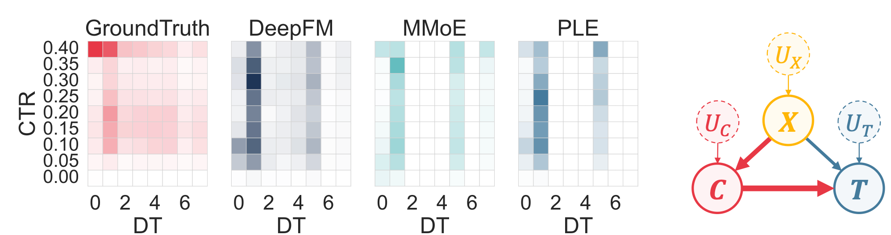
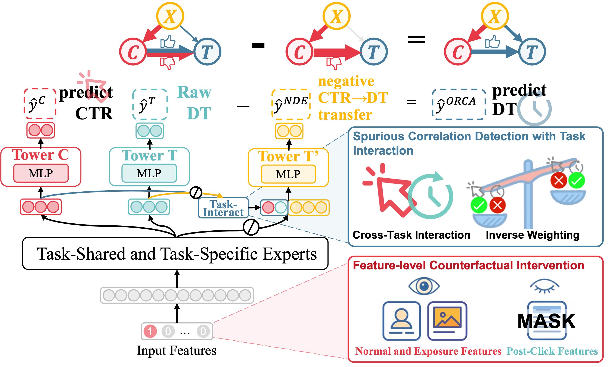

# ORCA: Mitigating Over-Reliance for Multi-Task Dwell Time Prediction with Causal Decoupling
> Official implementation of **ORCA**, accepted as a Short Paper at **CIKM 2025**.

ORCA is a causal-decoupling framework for multi-task recommendation learning, designed to mitigate CTR-driven over-reliance in dwell time prediction.  
This repository provides the official implementation of the paper.

- :page_facing_up: [Paper on arXiv (**recommended**)](https://arxiv.org/abs/2508.16573)  
- :globe_with_meridians: [Official CIKM 2025 Version](https://dl.acm.org/doi/10.1145/3746252.3760898)  

If you find this work useful in your research, please cite:
```bibtex
@inproceedings{10.1145/3746252.3760898,
author = {Luo, Huishi and Zhuang, Fuzhen and Zhu, Yongchun and Wu, Yiqing and Kang, Bo and Xie, Ruobing and Xia, Feng and Wang, Deqing and Dong, Jin},
title = {ORCA: Mitigating Over-Reliance for Multi-Task Dwell Time Prediction with Causal Decoupling},
year = {2025},
isbn = {9798400720406},
publisher = {Association for Computing Machinery},
address = {New York, NY, USA},
url = {https://doi.org/10.1145/3746252.3760898},
doi = {10.1145/3746252.3760898},
booktitle = {Proceedings of the 34th ACM International Conference on Information and Knowledge Management},
pages = {4996–5000},
numpages = {5},
keywords = {causal learning, dwell time prediction, multi-task learning},
location = {Seoul, Republic of Korea},
series = {CIKM '25}
}
```

---

## Overview


We observe that multi-task learning (MTL) models often skew dwell-time (DT) predictions toward the shortest and longest bins, severely under-representing moderate durations (Figure 1).  


<div align="center">
      
      <p><strong><figcaption>Figure 1:</strong> CTR–DT heatmaps of clicked impressions for the ground truth and classical models, and causal graph of MTL. <i>X</i>: input, <i>C</i>: clicks, <i>T</i>: dwell time, <i>U</i>: unobserved factors.</p>
</div>

We attribute this *moderate-duration bin under-representation* to over-reliance on the CTR-DT spurious correlation. This over-reliance leads the model to treat CTR as a shortcut for DT, losing the nuanced information needed for moderate-duration dwell time.

Therefore, we propose the **Over-Reliance-decoupled CAusal multi-task (ORCA)** framework to explicitly
model and subtract CTR’s negative transfer while preserving its positive transfer. ORCA integrates two key components: (i) feature-level counterfactual intervention, and (ii) a task-interaction module with instance inverse-weighting, weakening CTR-mediated effect and restoring direct DT semantics. 

<div align="center">
      
      <p><strong><figcaption>Figure 2:</strong> Overview of ORCA. Negative Dependency Extractor explicitly models the model’s over-reliance on CTR.</p>
</div>

## Repository structure

```text
.
├── LICENSE             # License file
├── README.md           # Project introduction and usage instructions
├── data\               # Raw and processed datasets
├── fig\                # Figures for the paper and README
├── main.py             # Entry point; parses arguments
├── main_orca.py        # Handles ORCA-specific training and testing logic
├── model
│   ├── layer.py        # Common model layer definitions
│   └── orca.py         # ORCA model architecture
├── preprocess
│   ├── industry.py     # Data preprocessing for industry datasets
│   └── tenrec.py       # Data preprocessing for Tenrec dataset
├── requirements.txt    # Python dependencies
└── result\             # Output results
```

## Datasets

We evaluate our model on two industrial datasets and the public [Tenrec](https://tenrec0.github.io) dataset.  

All datasets should be placed in the `data` directory. The preprocessing scripts in the `preprocess` directory will automatically process and export the preprocessed datasets when running the main program.

## Run

You can run this model through:

```bash
# Run directly with default parameters 
python main.py

# Run with specific parameters
python main.py --dataset_name tenrec
               --model_name orca
               --learning_rate 0.001
               --batch_size 512
```


## Related Repositories

We adapted some baseline code from [MTReclib](https://github.com/easezyc/Multitask-Recommendation-Library).

## License
This project is licensed under the MIT License.
